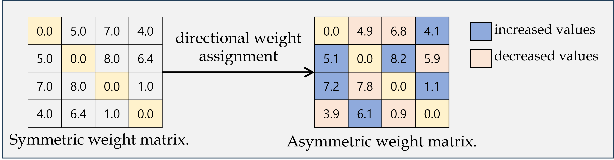

# T2G
We address the problem of time series classification(TSC) in graph environments. we present a novel concept of direction effect, emphasizing the impact of incorporating directionality into graph edges on classification performance. To exploit the direction effect positively, we propose a directional weight and a corresponding direction score to assign directionality to edges. 



## License

This project is licensed under the MIT License.  
It also includes code from Daochen Zha's implementation (MIT License, 2022).  
See the LICENSE file for details.

## Installation
Please use both Python 3.6. and Python 3.8
```
pip3 install -r requirements.txt
```

## Datasets
We provide an example dataset **Coffee** in this repository. You may download the full UCR datasets [here](https://www.cs.ucr.edu/~eamonn/time_series_data_2018/).

## Quick Start
We use **Coffee** as an example to demonstrate how to run the code. You may easily try other datasets with arguments `--dataset`. We will show how to get the results for SimTSC and T2G.

First, prepare the dataset with (the generated dataset is already available in this repository)
```
python3.6 create_dataset.py
```

Second, compute the dtw matrix for **Coffee** (the dtw matrix is already available in this repository). We used the pydtw implementation from https://github.com/daochenzha/pydtw.git, and we extended it by adding a lagged correlation(LC) computation feature.
```
python3.6 create_dtw.py
```

Third, compute the LC matrix for **Coffee** (the LC matrix is already available in this repository)
```
python3.6 LC_create.py
```

Fourth, compute the LC matrix for subsequence of  **Coffee** (the subsequence LC matrix is already available in this repository)
```
python3.6 LC_create_subsequence.py
```

1. For SimTSC:
```
python3.8 train_simtsc.py
```

2. For WholeLC:
```
python3.8 WholeLC.py
```

3. For SubLC:
```
python3.8 SubLC.py

All the logs will be saved in `logs/`
```

## Descriptions of the Files

1. `create_dataset.py` is a script to pre-process dataset and save them into npy. Some important hyperparameters are as follows.
*   `--dataset`: what dataset to process
*   `--shot`: how many training labels are given in each class

2. `create_dtw.py` is a script to calculate pair-wise DTW distances of a dataset and save them into npy. Some important hyperparameters are as follows.
*   `--dataset`: what dataset to process

3. `LC_create.py` is a script to calculate pair-wise LC values of a dataset and save them into npy. Some important hyperparameters are as follows.
*   `--dataset`: what dataset to process

4. `LC_create_subsequence.py` is a script to calculate pair-wise LC values for subsequences of a dataset and save them into npy. Some important hyperparameters are as follows.
*   `--dataset`: what dataset to process
*   `--w`: window size

5. `train_simtsc.py` is a script to do classification of a dataset with SimTSC. Some important hyperparameters are as follows.
*   `--dataset`: what dataset we operate on
*   `--shot`: how many training labels are given in each class
*   `--gpu`: which GPU to use
*   `--K`: number of neighbors per node in the constructed graph
*   `--alpha`: the scaling factor of the weights of the constructed graph
*   `--batch`: mini-batch size
*   `--epoch`: # of epochs

5. `WholeLC.py` is a script to do classification of a dataset with WholeLC. Some important hyperparameters are as follows.
*   `--dataset`: what dataset we operate on
*   `--shot`: how many training labels are given in each class
*   `--gpu`: which GPU to use
*   `--K`: number of neighbors per node in the constructed graph
*   `--alpha`: the scaling factor of the weights of the constructed graph
*   `--batch`: mini-batch size
*   `--epoch`: # of epochs

6. `SubLC.py` is a script to do classification of a dataset with SubLC. Some important hyperparameters are as follows.
*   `--dataset`: what dataset we operate on
*   `--shot`: how many training labels are given in each class
*   `--gpu`: which GPU to use
*   `--K`: number of neighbors per node in the constructed graph
*   `--alpha`: the scaling factor of the weights of the constructed graph
*   `--batch`: mini-batch size
*   `--epoch`: # of epochs
